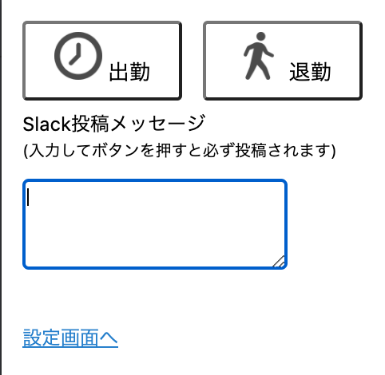
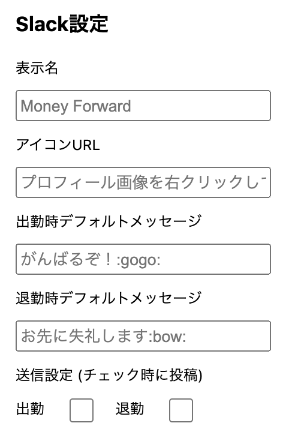
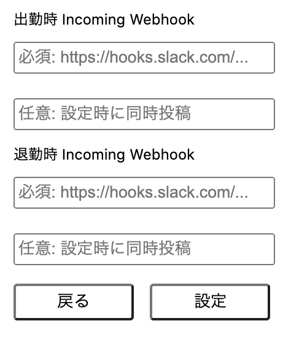

## セットアップ
⻘いマネーフォワードボタン(Chrome拡張)をタップすると以下のような画⾯が開きます。  
「設定画⾯へ」をタップします。  
||
  
  
Slackの表⽰に関する設定を⾏います。  
Slackで投稿されるメッセージは以下のようなものになります。  
  
|||
  

- 表示名
  - Slackへ表示する名称を記載します
- アイコンURL
  - SlackからアイコンのURLを取得して入力します
- 出勤時デフォルトメッセージ
- 退勤時デフォルトメッセージ
  - 出勤・退勤のアイコンをタップした際、Slack投稿メッセージに未入力の場合、こちらで設定されたメッセージが設定されます
- 送信設定
  - チェックを入れた場合、デフォルトメッセージで設定した内容が投稿されます
- 出勤時 Incoming Webhook
- 退勤時 Incoming Webhook
 - 投稿先のWebhookを作成し設定を行ってください
 - 出勤時、退勤時に2つまで設定可能です。兼務している等で2つのチャンネルに投稿が必要な場合は設定をおこなってください

## 挙動について
- Slack投稿メッセージに入力をした状態で出勤・退勤ボタンをタップした場合
  - 勤怠打刻＋入力内容でのSlackへ投稿
- Slack投稿メッセージが未入力状態で出勤・退勤ボタンをタップした場合
  - 送信設定でチェックが行われている場合
    - 勤怠打刻＋デフォルトメッセージでSlackへ投稿
  - 送信設定でチェックが行われていない場合
    - 勤怠打刻のみ  
